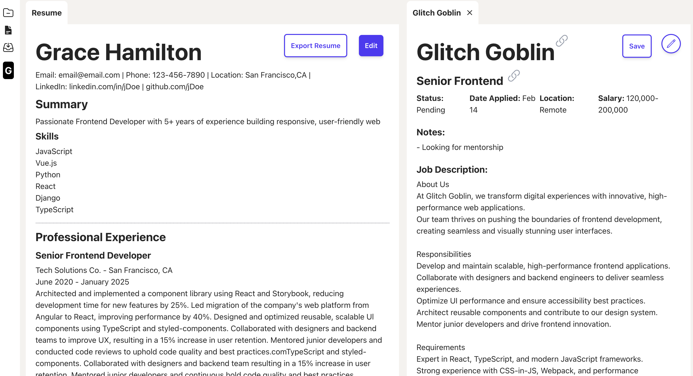
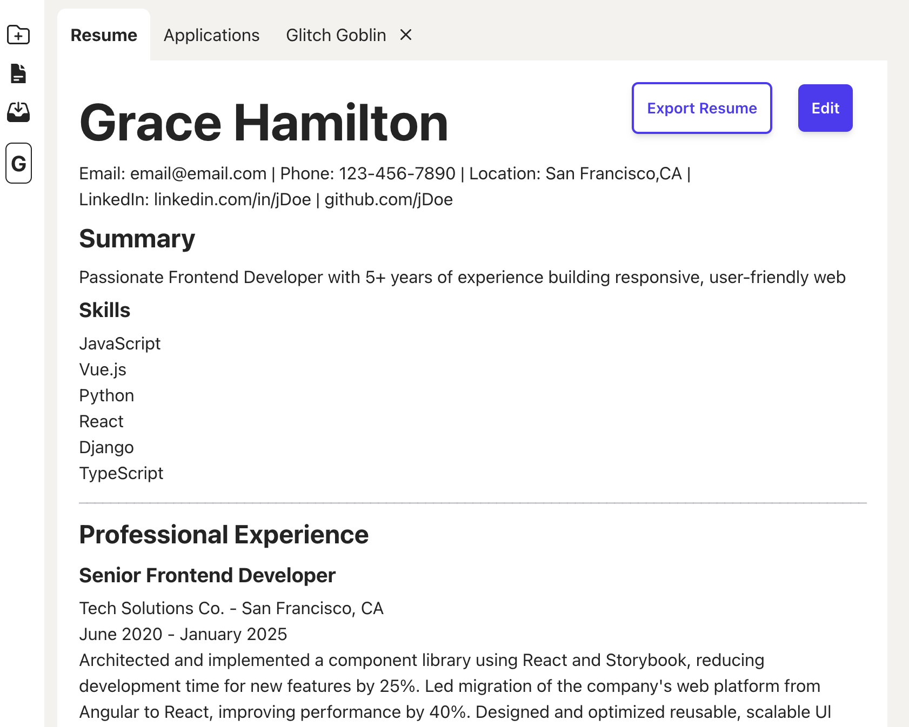

# Tyfyc

Tyfyc stands for “thank you for your consideration” this is to assist in customizing a person resume. This tool will allow you to upload your resume and job post you are interested in. You can then tailor your resume and track the application in one place.




## Features

- [x] AI research company
- [x] Manually add/change resume
- [x] Formats resume to downloadable PDF
- [x] Saves locally in cookies
- [x] Autofill resume from an existing resume
- [x] Saves Application details to csv
- [x] Auth login and access token api validation
- [x] Tracks applications
- [x] Auto update applications statuses
- [x] Option to research potential companies via OpenAI
- [x] Feature flags
- [x] Stats and Analytics
- [x] Scheduled application status update
- [ ] Updates resume according to job posting
- [ ] Job posting search
- [ ] Company rating

## OpenAI

add .env file in `/frontend` with an OPENAI_API_KEY and feature flag OPENAI_FEATURE_FLAG=true to get AI functionality.

# Development

## Frontend

```
cd frontend
```

Install Requirements

```
npm install
```

Start Frontend

```
npm run dev
```

Run locally http://localhost:8000/

### Compiles and minifies for production

```
npm run build
```

## Backend

```
cd backend
```

Set up Python environment

```
python -m venv venv
source ./venv/bin/activate
```

Install Requirements

```
pip install -r requirements.txt
```

Start backend

```
python ./main.py
```

Runs locally on http://localhost:8080/
Open API Docs on http://localhost:8080/docs#

### Database migration

Make revision

```
alembic revision -m "description here"
```

Run migration
upgrade

```
alembic upgrade head
// or
alembic upgrade [revision_number]
```

downgrade

```
alembic downgrade [revision_number]
```

## Project Structure

```
tyfyc/
│── public/                     # Static assets
│── backend/                    # FastAPI Backend
    │── alembic/                # Database revisions
    │── app/
        ├── auth/               # Auth and Token handler
        ├── parser/             # Document parser
        ├── routers/            # API Router
        ├── schemas/            # Schema and Typing
        ├── database.py         # sqlite database setup
        ├── models.py           # Database tables models
    |── main.py                 # Entry into the backend
│── frontend/                   # React Frontend
    │── src/
        ├── api/                # API connecting to backend
        ├── components/         # Reusable components
        ├── containers/         # Pages and Views
        ├── store/              # Redux store
        ├── types/              # TypeScript interfaces
        ├── App.tsx             # Root component
        ├── index.css           # Apps CSS
        ├── main.ts             # Entry file
    │── index.html              # Entry HTML
    │── package.json            # Dependencies and scripts
    │── vite.config.js          # Vite configuration
│── README.md                   # Project documentation
```

## Technologies Used

- React.js
- Vite
- TypeScript
- HTML & CSS
- Tailwind
- Tiptap
- FastAPI
- Sqlite
- Alembic
- OpenAI "gpt-3.5-turbo"
- License

## This project is licensed under the MIT License.
